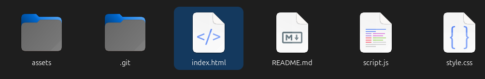

# ANDRE LUIZ BRANCO BELEM MYSZKO

#### RESUMO E AGRADECIMENTOS:
Agradeço pela oportunidade de participar do desafio de criar um case para SESI, muito interessante e produtivo!

Eu me preocupei com o prazo para entregar um mvp, tentando seguir o mais fielmente possivel o que foi proposto. 

**o projeto será atualizado até o final do dia 06/06/2024 - sexta-feira**

**informações do ultimo commit:**
não está perfeito, houveram algumas gambiarras e algumas partes não foram blocadas corretamente, mas para um prazo de um dia e meio de trabalho, até ficou interessante.

## PARA RODAR A APLICAÇÃO:
Certifique-se de ter baixado o repositório da branch ```main```, estar com os arquivos html, css e js na mesma pasta e possuir a pasta ```assets``` com seus devidos arquivos. 
Execute o arquivo html clicando duas vezes sobre ele, afim de abrir a página web no browser.



## OBSERVAÇÕES:
Como recomendado foi utilizado apenas CSS, HTM e JS para criação da página.

### IMAGENS
Percebi que as imagens são vetores, eu poderia trabalhar isso para simplificar o código, mas optei por utilizar as imagens, o que é mais custoso, tanto em tempo quanto aramazenamento... desta forma não utilizei todas as cores, apenas uma única  imagem para cada padrão de imagem... 
Em um projeto real eu poderia gerar ou pedir os  vetores para o designer da equipe e trabalhar core, animações ou automações no código.

### CAROUSEL
O carousel de cards no tamanho mobile não foi implementado ainda, muito penoso em curto espeço de tempo com vanilla js. Vamos ver nos proximos updates até sexta feira.

### FORM & TESTES
Não foram aplicados testes nos requests fictícios fo formulário de materiais, apenas regex simples em alguns dos campos e lógica simples em outros como quantidade de caracteres, desta forma o formulário é meramente inlustrativo, não validado completamente.


#### FERRAMENTAS QUE EU UTILIZARIA PARA PRODUÇÃO:

- **vue 3 TS** (vite, node/modules, npm/npx, requests)
    Para criar Sigle Page Application (SPA) com assistencia de modulos node e fail integração com backends (APIs, Databases), além de facilitar a criação de módulos e gerenciamento do projeto em si, como URLS, componentes, etc...

- **github actions** (branches/workflow/secrets)
    Para gerenciar o desenvolvimento, manutenção e implementação do projeto em um pipeline controlável e previsível, de fácil acesso e controle pela equipe.

- **firebase** (deploy/domain/sa/hosting)
    Para hospedar o website, providenciar um domínio e vincular o deploy do github automaticamente pelo workflow, estabelecer administradores, etc.

- **google storage** (firebase/google, imagens, pdfs, etc..)
    Para armazenar os arquivos de materiais enviados para os alunos, assim como armazenar todos os assets do website, como as imagens, etc. É acessível diretamente pelo firebase ou pela organização do Google.

- **google analytics** (metricas)
    Controlaria os clicks do site pelo google analytics caso fosse importante para equipe, saber quantos materiais foram entregues, para quem em qual data, etc...


# **PLUS** (lugand)
    não deixem de visitar o meu website para ter uma ideia de como ficam os resultados com as ferramentas que utiliza, o site está em desenvolvimento, então a loja e o login, chatbot não estarão funcionando (apenas em desenvolvimento para mim), mas conseguem ver algumas tácnicas de frontend que utilizei nele, como:
        - SPA
        - DARK MODE
        - DROPDOWNS
        - ANIMATIONS
        - CHAT
        - etc
    os textos são meramente placeholders.. enfim, para avaliar técnicas de front end.

    LUGAND SISTEMAS LTDA:
    https://lugand.com.br/